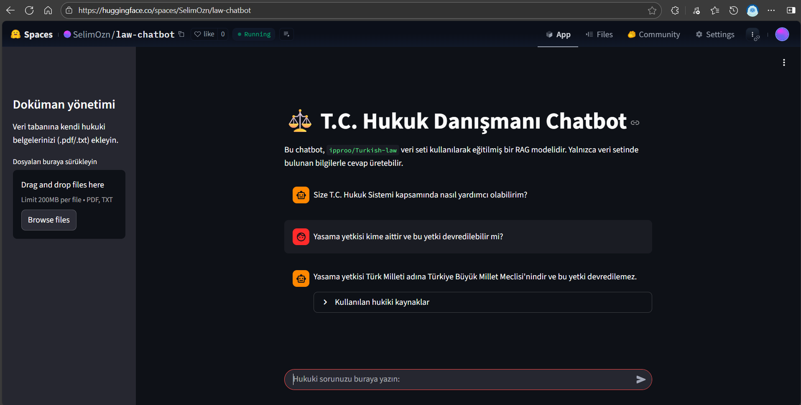

<div align="center">

# T.C. Hukuk Danışmanı Chatbot


T.C. Hukuk Sistemi üzerine uzmanlaşmış, RAG (Retrieval-Augmented Generation) tabanlı yapay zeka chatbot. `ipproo/Turkish-law` veri seti ve kullanıcı tarafından yüklenen PDF/TXT dosyaları üzerinden hukuki soruları yanıtlar.

</div>

## Kullanımı

-   Chatbot'a doğrudan hukuki sorular sorabilirsiniz (Örn: "Federasyon nasıl kurulur?").
-   Kenar çubuğundaki (sidebar) "Doküman Yönetimi" alanından kendi `.pdf` veya `.txt` uzantılı hukuki belgelerinizi (kanun metinleri, Yargıtay kararları vb.) yükleyebilirsiniz.
-   Chatbot, hem temel veri setinden hem de sizin yüklediğiniz belgelerden (Hybrid Search kullanarak) kaynak bularak cevap üretir.
-   Konuşma hafızası sayesinde, önceki mesajlarınıza atıfta bulunarak takip soruları (Örn: "Peki bu davanın temyizi nedir?") sorabilirsiniz.
-   Cevabın altında "Kullanılan hukuki kaynaklar" bölümünden, cevabın hangi belgelere dayandığını görebilirsiniz.

## Veri Seti

-   ipproo/Turkish-law; yalnızca Türk anayasasını içeren, Chatgpt, Claude vb. gibi sohbet robotları kullanılarak toplanmış, soru cevap şeklinde veriler içerir.
-   Eğer kullanıcı doküman yüklerse, doğrudan bu doküman da veri seti olarak kullanılmaktadır.

## Teknoloji

-   **Python 3.12**
-   **Streamlit:** Web arayüzü
-   **LangChain:** RAG pipeline'ı, zincirler (chains), hafıza (memory) ve retrieval (veri getirme) yönetimi
-   **Google Gemini (langchain-google-genai):** Dil modeli (LLM)
-   **ChromaDB:** Vektör veritabanı (semantik arama için)
-   **BM25 (rank-bm25):** Anahtar kelime (keyword) araması
-   **EnsembleRetriever (LangChain):** Semantik (Chroma) ve anahtar kelime (BM25) aramalarını birleştiren Hybrid Search (Hibrit Arama)
-   **Hugging Face Embeddings:** `sentence-transformers/paraphrase-multilingual-mpnet-base-v2` modeli (metinleri vektöre dönüştürmek için)
-   **Hugging Face Datasets:** `ipproo/Turkish-law` (temel bilgi veri seti)

## Kurulum

Projeyi yerel makinenizde çalıştırmak için aşağıdaki adımları izleyin:

1.  **Depoyu klonlayın:**
    ```bash
    git clone https://github.com/SelimOzn/law-chatbot.git
    cd law-chatbot
    ```

2.  **Gerekli kütüphaneleri yükleyin:**
    ```bash
    # Virtual environment oluşturup active edin (opsiyonel)
    python3 -m venv chatbot-env
    chatbot-env\Scripts\activate #Windows
    #source chatbot-env/bin/activate  # macOS/Linux
    pip install -r requirements.txt
    ```

3.  **API Anahtarını ayarlayın:**
    -   Proje ana dizininde `.env` adında bir dosya oluşturun.
    -   İçine Google AI Studio üzerinden aldığınız API anahtarınızı ekleyin:
      ```
      GOOGLE_API_KEY="YOUR_API_KEY_HERE"
      ```

4.  **Vektör Veritabanını Oluşturun:**
    -   Uygulama, veritabanı yoksa ilk açılışta otomatik olarak oluşturabilir. Ancak bu işlem (embedding hesaplama) **birkaç dakika sürebilir** ve uygulamanın ilk açılışta donmuş gibi görünmesine neden olabilir.

    -   Bunu engellemek ve daha hızlı bir ilk açılış sağlamak için, uygulamayı çalıştırmadan *önce* aşağıdaki komutla veritabanını manuel olarak oluşturmanız önerilir:
    ```bash
    python db_conf.py
    ```

5.  **Uygulamayı çalıştırın:**
    ```bash
    streamlit run app.py

## Proje Yapısı
```
law-chatbot/
├── data/                     # ChromaDB veritabanı dosyalarının saklandığı klasör (db_conf.py tarafından oluşturulur)
├── app.py                    # Ana Streamlit uygulaması + RAG sorgu akışı
├── db_conf.py                # Veri tabanını oluşturma
├── requirements.txt          # Bağımlılıklar
├── .env                      # GOOGLE_API_KEY
└── README.md                 # Bu dosya
```

## Web Linki
- [https://huggingface.co/spaces/SelimOzn/law-chatbot](https://huggingface.co/spaces/SelimOzn/law-chatbot)


**Şekil 1**  Hugging Face Spaces üzerinde çalışan *T.C. Hukuk Danışmanı Chatbot* arayüzü. Solda kullanıcıların kendi hukuki belgelerini (.pdf veya .txt) yükleyebileceği doküman yönetimi bölümü, sağda ise chatbot ile etkileşim arayüzü görülüyor. Chatbot, `ipproo/Turkish-law` veri seti ve kullanıcılar tarafından yüklenen dokümanlar ile eğitilmiş bir RAG modeli olup, Türk hukuk sistemi kapsamında sorulara yanıt üretebiliyor. Kullanılan hukuki kaynaklar kısmında modelin cevap verirken bağlam olarak yararlandığı gerçek veri parçalarının özetlenmiş hallerini bulabilirsiniz. 
